# Домашнее задание к занятию 16.5 "`Практическое применение Docker`" - `Маховский Виктор`

### Инструкция к выполнению

1. Для выполнения заданий обязательно ознакомьтесь с [инструкцией](https://github.com/netology-code/devops-materials/blob/master/cloudwork.MD) по экономии облачных ресурсов. Это нужно, чтобы не расходовать средства, полученные в результате использования промокода.
3. **Своё решение к задачам оформите в вашем GitHub репозитории.**
4. В личном кабинете отправьте на проверку ссылку на .md-файл в вашем репозитории.
5. Сопроводите ответ необходимыми скриншотами.

---
## Примечание: Ознакомьтесь со схемой виртуального стенда [по ссылке](https://github.com/netology-code/shvirtd-example-python/blob/main/schema.pdf)

---

## Задача 0
1. Убедитесь что у вас НЕ(!) установлен ```docker-compose```, для этого получите следующую ошибку от команды ```docker-compose --version```
```
Command 'docker-compose' not found, but can be installed with:

sudo snap install docker          # version 24.0.5, or
sudo apt  install docker-compose  # version 1.25.0-1

See 'snap info docker' for additional versions.
```
В случае наличия установленного в системе ```docker-compose``` - удалите его.  
2. Убедитесь что у вас УСТАНОВЛЕН ```docker compose```(без тире) версии не менее v2.24.X, для это выполните команду ```docker compose version```  
###  **Своё решение к задачам оформите в вашем GitHub репозитории!!!!!!!!!!!!!!!!!!!!!!!!!!!!!!!!**

---

## Задача 1
1. Сделайте в своем GitHub пространстве fork [репозитория](https://github.com/netology-code/shvirtd-example-python).

2. Создайте файл ```Dockerfile.python``` на основе существующего `Dockerfile`:
   - Используйте базовый образ ```python:3.12-slim```
   - Обязательно используйте конструкцию ```COPY . .``` в Dockerfile
   - Создайте `.dockerignore` файл для исключения ненужных файлов
   - Используйте ```CMD ["uvicorn", "main:app", "--host", "0.0.0.0", "--port", "5000"]``` для запуска
   - Протестируйте корректность сборки
2.1 Используйте multistage сборку вместо single stage.
3. (Необязательная часть, *) Изучите инструкцию в проекте и запустите web-приложение без использования docker, с помощью venv. (Mysql БД можно запустить в docker run).
4. (Необязательная часть, *) Изучите код приложения и добавьте управление названием таблицы через ENV переменную.
---
### ВНИМАНИЕ!
!!! В процессе последующего выполнения ДЗ НЕ изменяйте содержимое файлов в fork-репозитории! Ваша задача ДОБАВИТЬ 5 файлов: ```Dockerfile.python```, ```compose.yaml```, ```.gitignore```, ```.dockerignore```,```bash-скрипт```. Если вам понадобилось внести иные изменения в проект - вы что-то делаете неверно!
---

### Ответ:

`План выполнения:`
```
1. Создаем файлы

2. Делаем скрипт исполняемым
chmod +x deploy.sh

3. Проверить все файлы
ls -la Dockerfile.python .dockerignore compose.yaml .gitignore deploy.sh

4. Тестируем сборку
docker build -f Dockerfile.python -t test-app .

5. Запускам приложение + MySQL
docker compose -f compose.yaml up -d

6. Проверяем
curl http://localhost:5000/

```

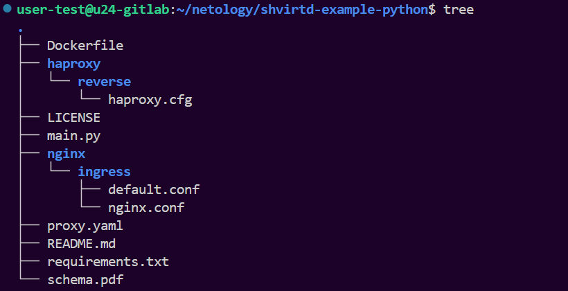

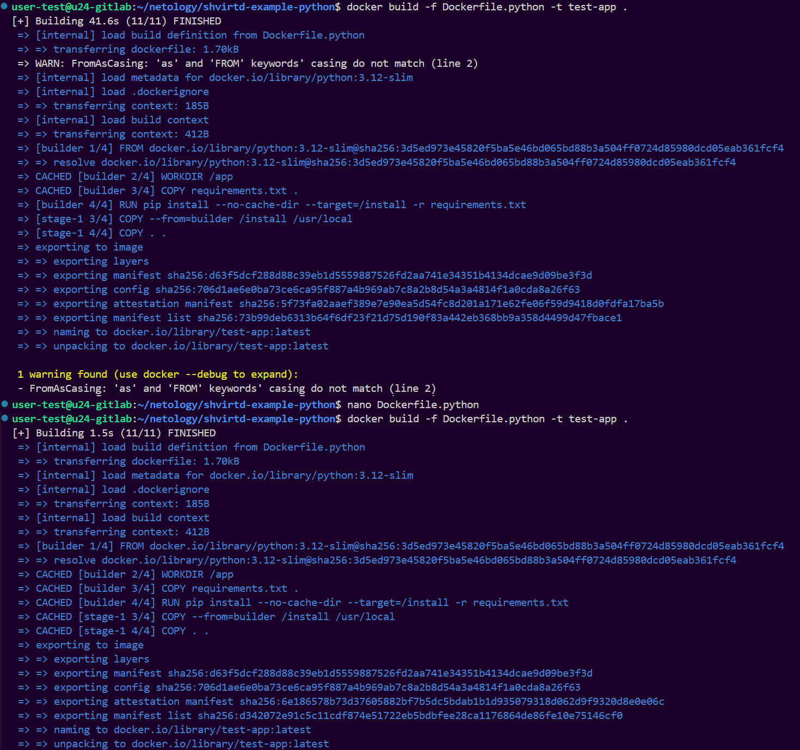

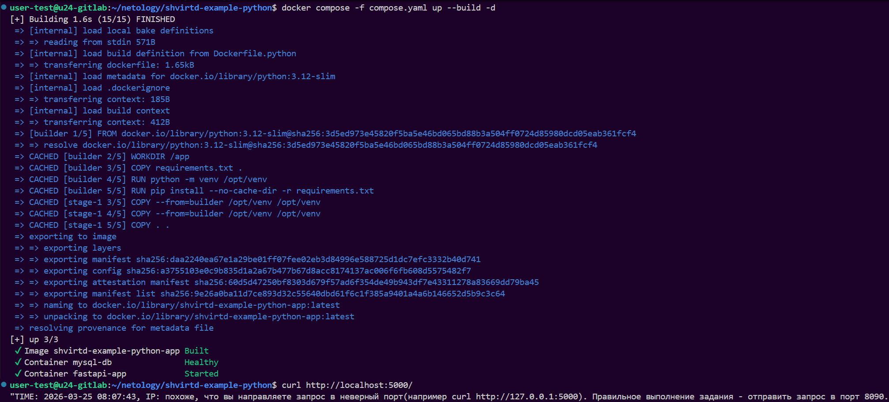

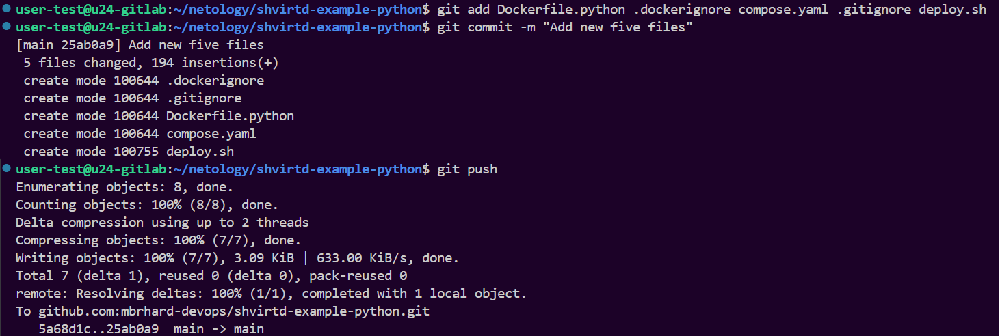

---


## Задача 2 (*)
1. Создайте в yandex cloud container registry с именем "test" с помощью "yc tool" . [Инструкция](https://cloud.yandex.ru/ru/docs/container-registry/quickstart/?from=int-console-help)
2. Настройте аутентификацию вашего локального docker в yandex container registry.
3. Соберите и залейте в него образ с python приложением из задания №1.
4. Просканируйте образ на уязвимости.
5. В качестве ответа приложите отчет сканирования.

---


## Задача 3
1. Изучите файл "proxy.yaml"
2. Создайте в репозитории с проектом файл ```compose.yaml```. С помощью директивы "include" подключите к нему файл "proxy.yaml".
3. Опишите в файле ```compose.yaml``` следующие сервисы: 

- ```web```. Образ приложения должен ИЛИ собираться при запуске compose из файла ```Dockerfile.python``` ИЛИ скачиваться из yandex cloud container registry(из задание №2 со *). Контейнер должен работать в bridge-сети с названием ```backend``` и иметь фиксированный ipv4-адрес ```172.20.0.5```. Сервис должен всегда перезапускаться в случае ошибок.
Передайте необходимые ENV-переменные для подключения к Mysql базе данных по сетевому имени сервиса ```web``` 

- ```db```. image=mysql:8. Контейнер должен работать в bridge-сети с названием ```backend``` и иметь фиксированный ipv4-адрес ```172.20.0.10```. Явно перезапуск сервиса в случае ошибок. Передайте необходимые ENV-переменные для создания: пароля root пользователя, создания базы данных, пользователя и пароля для web-приложения.Обязательно используйте уже существующий .env file для назначения секретных ENV-переменных!

2. Запустите проект локально с помощью docker compose , добейтесь его стабильной работы: команда ```curl -L http://127.0.0.1:8090``` должна возвращать в качестве ответа время и локальный IP-адрес. Если сервисы не стартуют воспользуйтесь командами: ```docker ps -a ``` и ```docker logs <container_name>``` . Если вместо IP-адреса вы получаете информационную ошибку --убедитесь, что вы шлете запрос на порт ```8090```, а не 5000.

5. Подключитесь к БД mysql с помощью команды ```docker exec -ti <имя_контейнера> mysql -uroot -p<пароль root-пользователя>```(обратите внимание что между ключем -u и логином root нет пробела. это важно!!! тоже самое с паролем) . Введите последовательно команды (не забываем в конце символ ; ): ```show databases; use <имя вашей базы данных(по-умолчанию virtd, как это указано в .env)>; show tables; SELECT * from requests LIMIT 10;```. Примечание: таблица в БД создается после первого поступившего запроса к приложению.

6. Остановите проект. В качестве ответа приложите скриншот sql-запроса.

### Ответ:

`План выполнения:`
```
1. Запускаем
docker compose -f compose.yaml up --build -d

2. Проверяем
docker compose -f compose.yaml ps

3. Подключаемся к БД
docker exec -ti mysql-db mysql -uroot -pYtReWq4321

4. Внутри Mysql
Смотрим базы данных
show databases;

Выбираем базу по заданию
use virtd;

Показываем таблицы
show tables;

Показать первые 10 записей
SELECT * from requests LIMIT 10;

Выходим
exit;

```

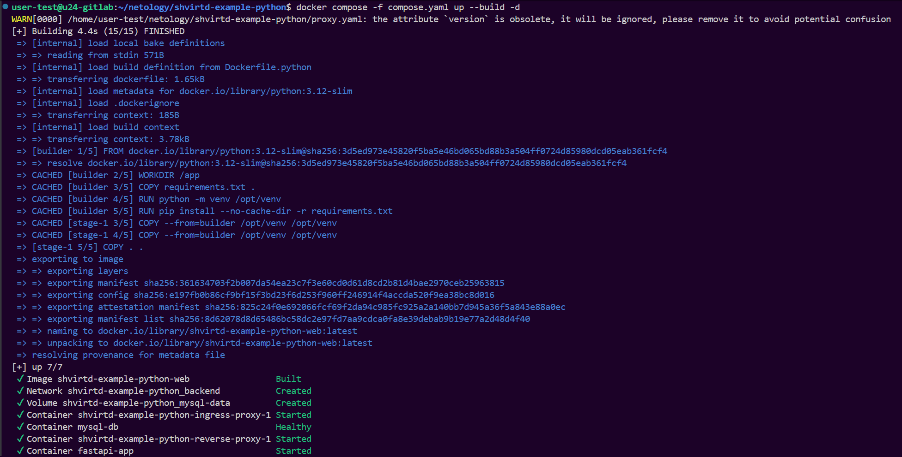

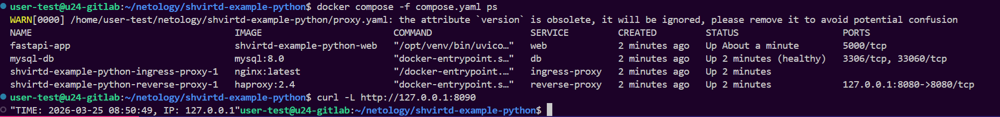

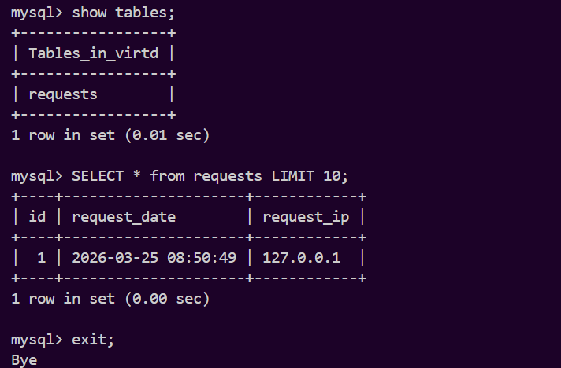

---


## Задача 4
1. Запустите в Yandex Cloud ВМ (вам хватит 2 Гб Ram).
2. Подключитесь к Вм по ssh и установите docker.
3. Напишите bash-скрипт, который скачает ваш fork-репозиторий в каталог /opt и запустит проект целиком.
4. Зайдите на сайт проверки http подключений, например(или аналогичный): ```https://check-host.net/check-http``` и запустите проверку вашего сервиса ```http://<внешний_IP-адрес_вашей_ВМ>:8090```. Таким образом трафик будет направлен в ingress-proxy. Трафик должен пройти через цепочки: Пользователь → Internet → Nginx → HAProxy → FastAPI(запись в БД) → HAProxy → Nginx → Internet → Пользователь
5. (Необязательная часть) Дополнительно настройте remote ssh context к вашему серверу. Отобразите список контекстов и результат удаленного выполнения ```docker ps -a```
6. Повторите SQL-запрос на сервере и приложите скриншот и ссылку на fork.

### Ответ:

1. 
```
# Создаем сеть
yc vpc network create --name swarm-net

# Создаём подсеть 
yc vpc subnet create \
  --name swarm-subnet \
  --zone ru-central1-a \
  --range 10.0.0.0/24 \
  --network-name swarm-net \
  --description "Subnet swarm-net"

# Создаем группу
yc vpc security-group create \
  --name swarm-sg \
  --network-name swarm-net \
  --description "For home 16-5 task 4" \
  --rule "direction=ingress,port=22,protocol=tcp,v4-cidrs=0.0.0.0/0" \
  --rule "direction=ingress,port=8090,protocol=tcp,v4-cidrs=0.0.0.0/0" \
  --rule "direction=egress,from-port=0,to-port=65535,protocol=tcp,v4-cidrs=0.0.0.0/0" \
  --rule "direction=egress,from-port=0,to-port=65535,protocol=udp,v4-cidrs=0.0.0.0/0" \
  --rule "direction=egress,protocol=icmp,v4-cidrs=0.0.0.0/0"

# Объявляем переменные
SUBNET_ID=$(yc vpc subnet list --format json | jq -r '.[] | select(.network_id=="enpsl8egule4u96hnl68") | .id')
echo "SUBNET_ID: $SUBNET_ID"

SG_ID=enppbb5fbd5n6vgm8ipe
echo "SG_ID: $SG_ID"

IMAGE_ID=fd805090je9atk2b9jon
SSH_KEY="ubuntu:$(cat ~/.ssh/id_ed25519.pub)"

# Создаем машину
yc compute instance create \
  --name home16-5-4-vm \
  --zone ru-central1-a \
  --platform standard-v3 \
  --cores 2 --memory 4GB --core-fraction 20 \
  --create-disk type=network-hdd,size=20GB,image-id=$IMAGE_ID \
  --network-interface subnet-id=$SUBNET_ID,nat-ip-version=ipv4,security-group-ids=$SG_ID \
  --metadata ssh-keys="$SSH_KEY" \
  --hostname home16-5-4-vm

# Проверяем
yc compute instance list

# Подключаемся
ssh -i ~/.ssh/id_ed25519 ubuntu@178.154.206.70

```

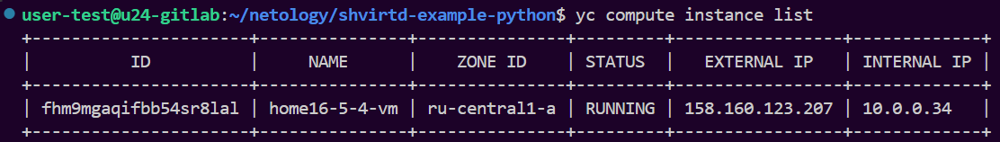

2. Установка Docker Engine на Ubuntu
```
Для установки докера потребуется дополнительно загрузить 4 пакета, а именно:
•	curl — необходим для работы с веб-ресурсами;
•	software-properties-common — пакет для управления ПО с помощью скриптов;
•	ca-certificates — содержит информацию о центрах сертификации;
•	apt-transport-https — необходим для передачи данных по протоколу HTTPS.

# Add Docker's official GPG key:
sudo apt update
sudo apt install ca-certificates curl
sudo install -m 0755 -d /etc/apt/keyrings
sudo curl -fsSL https://download.docker.com/linux/ubuntu/gpg -o /etc/apt/keyrings/docker.asc
sudo chmod a+r /etc/apt/keyrings/docker.asc

# Add the repository to Apt sources:
echo \
  "deb [arch=$(dpkg --print-architecture) signed-by=/etc/apt/keyrings/docker.asc] https://download.docker.com/linux/ubuntu \
  $(. /etc/os-release && echo "${UBUNTU_CODENAME:-$VERSION_CODENAME}") stable" | \
  sudo tee /etc/apt/sources.list.d/docker.list > /dev/null
sudo apt update
sudo apt install docker-ce docker-ce-cli containerd.io docker-buildx-plugin docker-compose-plugin -y

# Для запуск без root
sudo groupadd docker
sudo usermod -aG docker $USER
newgrp docker

# Проверяем
docker --version
docker compose version
```

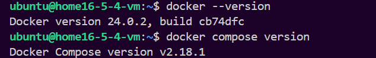

3. Напишите bash-скрипт, который скачает ваш fork-репозиторий в каталог /opt и запустит проект целиком.
`Скрипт:`

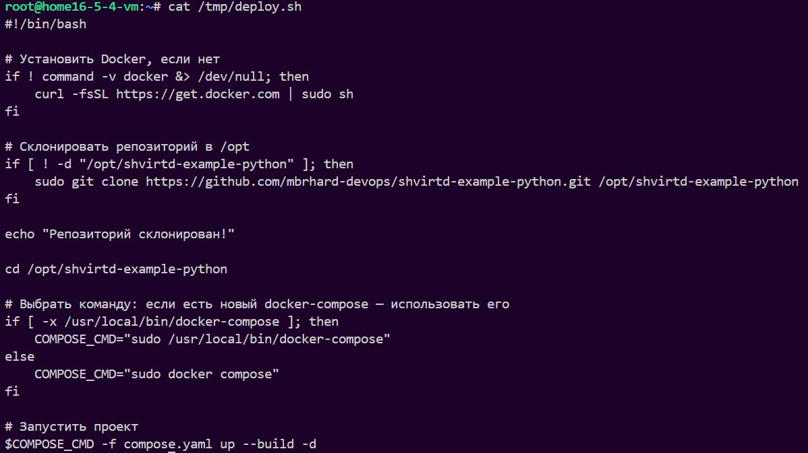

`Команды:`
```
1. Создаем и запускаем скрипт
nano /tmp/deploy.sh
chmod +x /tmp/deploy.sh
sudo /tmp/deploy.sh

2. Подключаемся к БД
docker exec -ti mysql-db mysql -uroot -pYtReWq4321

3. Внутри Mysql
Смотрим базы данных
show databases;

Выбираем базу по заданию
use virtd;

Показываем таблицы
show tables;

Показать первые 10 записей
SELECT * from requests LIMIT 10;

Выходим
exit;

```

4. Зайдите на сайт проверки http подключений, например(или аналогичный)

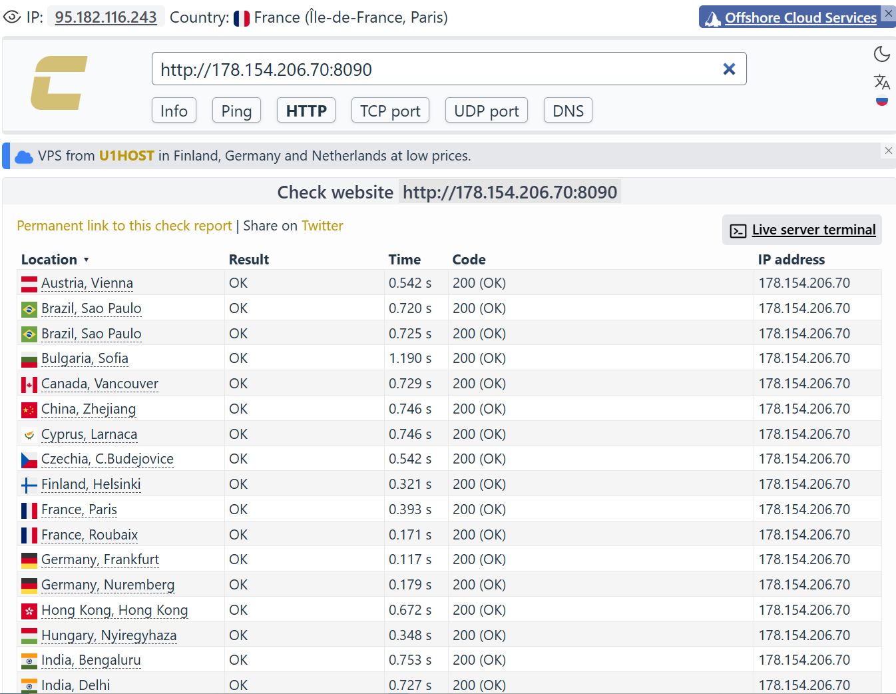

6. Повторите SQL-запрос на сервере и приложите скриншот и ссылку на fork.

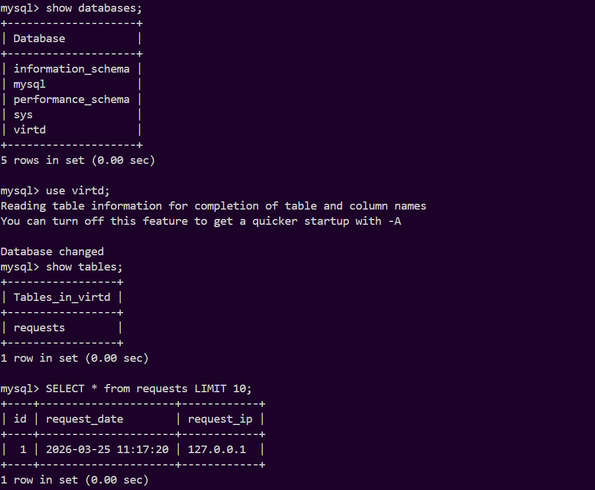

`Ссылка:`
https://github.com/mbrhard-devops/shvirtd-example-python

---


## Задача 5 (*)
1. Напишите и задеплойте на вашу облачную ВМ bash скрипт, который произведет резервное копирование БД mysql в директорию "/opt/backup" с помощью запуска в сети "backend" контейнера из образа ```schnitzler/mysqldump``` при помощи ```docker run ...``` команды. Подсказка: "документация образа."
2. Протестируйте ручной запуск
3. Настройте выполнение скрипта раз в 1 минуту через cron, crontab или systemctl timer. Придумайте способ не светить логин/пароль в git!!
4. Предоставьте скрипт, cron-task и скриншот с несколькими резервными копиями в "/opt/backup"

## Задача 6
Скачайте docker образ ```hashicorp/terraform:latest``` и скопируйте бинарный файл ```/bin/terraform``` на свою локальную машину, используя dive и docker save.
Предоставьте скриншоты  действий .

### Ответ:

```
docker pull hashicorp/terraform:latest

sudo snap install dive

dive hashicorp/terraform:latest

docker run --rm -it   -v /var/run/docker.sock:/var/run/docker.sock   wagoodman/dive:latest   hashicorp/terraform:latest

```

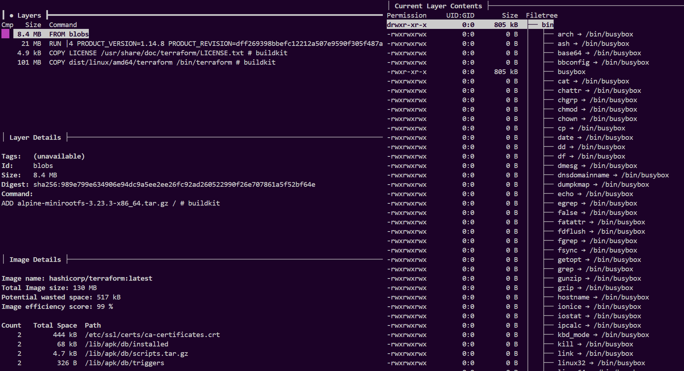


```
docker save hashicorp/terraform:latest -o terraform-image.tar

# Создаем временный контейнер
docker create --name tf-temp hashicorp/terraform:latest

# Копируем бинарник
docker cp tf-temp:/bin/terraform ./terraform

# Удаляем временный контейнер
docker rm tf-temp

ls -lh terraform

```

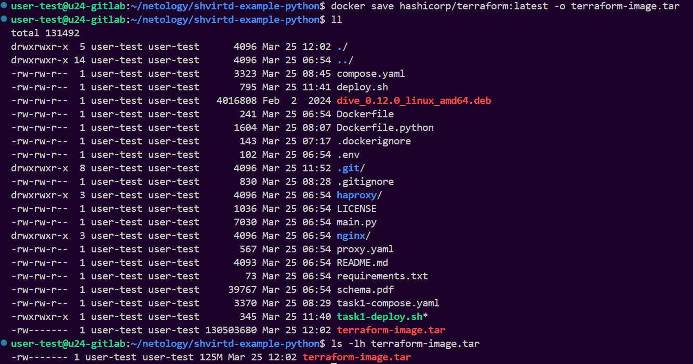

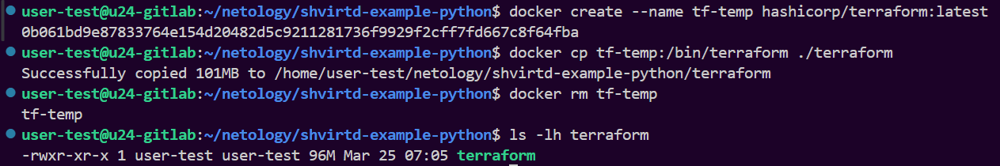

---


## Задача 6.1
Добейтесь аналогичного результата, используя docker cp.  
Предоставьте скриншоты  действий .

### Ответ:

```
# Просто создаем контейнер
docker create --name terraform-container hashicorp/terraform:latest

# Смотрим
docker export terraform-container | tar -t | grep bin/terraform

# Скопировать бинарник
docker cp terraform-container:/bin/terraform ./terraform

# Проверям
ls -lh terraform

# Проверяем, что все хорошо
./terraform version
```

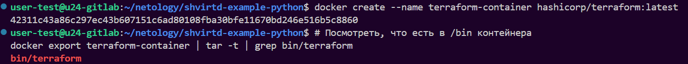

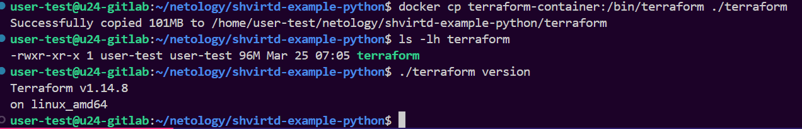

## Задача 6.2 (**)
Предложите способ извлечь файл из контейнера, используя только команду docker build и любой Dockerfile.  
Предоставьте скриншоты  действий .

## Задача 7 (***)
Запустите ваше python-приложение с помощью runC, не используя docker или containerd.  
Предоставьте скриншоты  действий .

---


